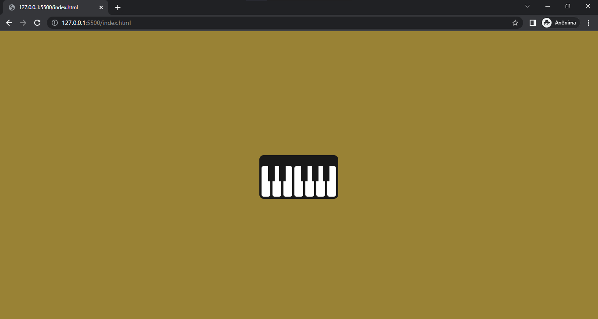

<h1 align="center">
	CSS BATTLE - Piano
</h1>

Desafio de css realizado no site [CSSBattle](https://cssbattle.dev/).

  

  

## 🔥 Preview

    

## 📁 Projeto

O desafio consiste em produzir com perfeição o objeto indicado, nesse repositório foi realizado o desafio do [Piano](cssbattle.dev/play/80).

Para obter mais pontos no site, é necessário reproduzir com perfeição o objeto no menor número de caracteres escritos possível.

## 🚀 **Em constante evolução...**

---

Feito com ♥ by [Daniel Corona](https://www.linkedin.com/in/dnlcorona/)